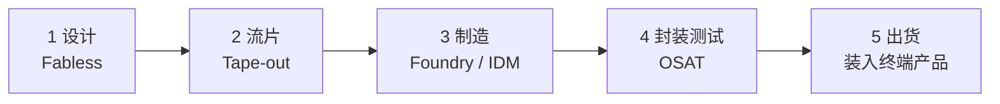
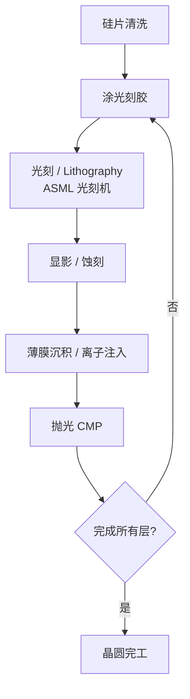

> 一颗芯片从「设计」到能装进服务器，要经历 5 个大步骤、几百道工序、6-12 周的工厂时间。本文用最少的术语把流程串起来。

## 整体流程

## 1. 设计（Design）

- **谁做**：Fabless 公司或 IDM 的设计部门（Nvidia、Apple、AMD、海思）
- **做什么**：用 EDA 软件（Synopsys / Cadence）画"电路图"，决定每个晶体管放在哪、怎么连
- **关键**：架构（CPU/GPU/NPU）+ IP（ARM、RISC-V）+ 工艺节点选择（3nm / 5nm）

## 2. 流片（Tape-out）

- **谁做**：设计公司把"版图（GDSII 文件）"交给代工厂
- **做什么**：制作 **光罩（Mask）**——相当于"印刷模板"，每一层电路对应一张
- **代价**：3nm 一次流片成本约 **5 亿美元**，错一点就要重来

## 3. 制造（Fabrication）— 整个产业最难、最贵的环节

- **谁做**：Foundry（TSMC、SMIC）或 IDM（Intel、Samsung）
- **做什么**：把光罩上的图案"印"到硅片上，反复几百次

简化版工序：

- **核心设备**：ASML 的 **EUV 光刻机**（一台 1.5 亿美元起，全球只有它能造）
- **核心指标**：**良率（Yield）**——每片晶圆有多少颗芯片是好的；先进制程初期良率可能只有 50%

## 4. 封装测试（OSAT）

- **谁做**：日月光（ASE）、Amkor、长电、通富、TSMC（先进封装）
- **做什么**：
  1. **切割**：把晶圆切成一颗颗"裸片（Die）"
  2. **封装**：装进塑料/陶瓷外壳，引出针脚
  3. **测试**：每颗都通电测一遍，剔除坏的

> **AI 时代最关键的变化**：以前封装是"穿衣服"的最后一步，现在变成 **CoWoS、3D 封装** 这种把 GPU + HBM 拼成一个超级芯片的核心环节。TSMC 的 CoWoS 产能甚至成了全球 AI 算力的瓶颈。

## 5. 出货（Distribution）

- 装进服务器、手机、汽车、光模块……最终到用户手里

## 关键认知

1. **"卡脖子"主要卡在第 3 步**：先进制程 = ASML 光刻机 + TSMC/Samsung/Intel 工艺 + Shin-Etsu 等材料
2. **AI 时代的瓶颈搬到第 4 步**：CoWoS 先进封装、HBM 堆叠、热管理
3. **设计本身的门槛在下降**：开源 IP（RISC-V）、AI 辅助 EDA、chiplet 化让设计成本降低
4. **从设计到量产 = 1.5 - 3 年**：所以芯片公司的指引和路线图比当下营收更重要

## 接下来读什么

- 看产业链全景 → 「[上下游全景图](#)」
- 看具体公司 → 「[公司档案库](../../companies/)」
- 看制程演进 → 「[技术 & 周期](../../tech/)」
