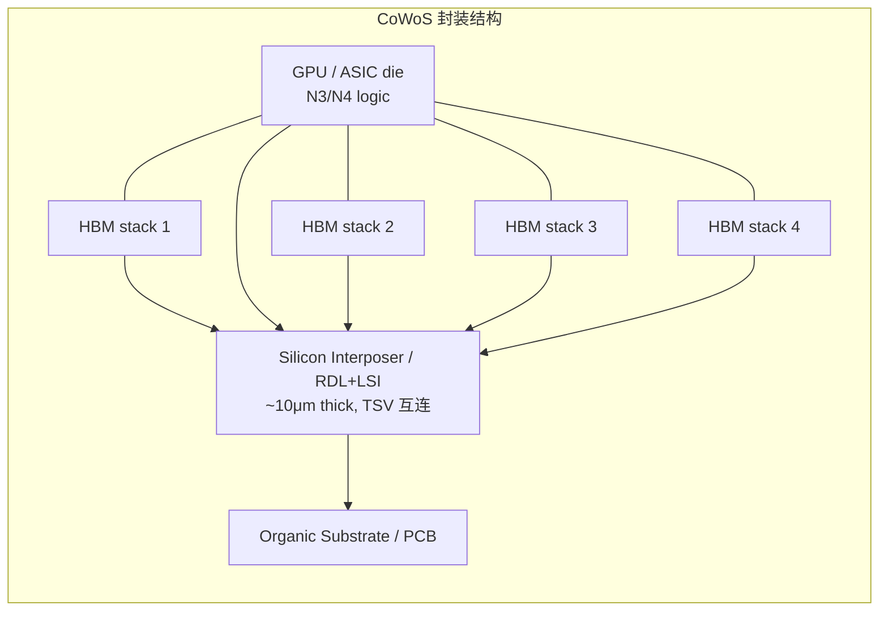

## 是什么

**CoWoS = Chip-on-Wafer-on-Substrate**，TSMC 的 2.5D 先进封装平台。
最简单的理解：把多颗"裸片"（die）—— 一颗 GPU + 多颗 HBM ——
**先并排放在一片硅做的"中介层"（interposer）上**，再把这片中介层焊到普通 PCB 基板上，
最后封成一颗大芯片。

为什么要这么折腾？因为 **AI 加速器的瓶颈从来不是逻辑算力，而是"算力旁边塞多少 HBM、用多宽的接口连"**。
HBM 必须紧贴 GPU 才能跑出 TB/s 级别的带宽，普通 PCB 距离太远、损耗太大；
而硅 interposer 上 **金属线宽可以做到 0.4μm**，等同把 HBM 和 GPU 焊在"同一片晶圆"上。

> 一句话：**CoWoS 是把多颗芯片"拼成"一颗超级芯片的胶水**。
> Nvidia H100 / B200、AMD MI300 / MI400、Google TPU、AWS Trainium 全部都靠它。

## 为什么 AI 必须 2.5D / 3D 封装

三个物理约束逼出了先进封装：

1. **单颗 die 有 reticle limit**（光刻机最大曝光面积，约 858 mm²）。Nvidia B200 已经接近这个上限——
   想再大，必须把两颗 die 拼起来，B200 就是 2 颗 reticle-limit die 用 NV-HBI 拼接。
2. **HBM 必须近距离高密度连接**。一个 H100 / B200 要连 6–8 颗 HBM 堆，普通封装连不了那么宽的总线（数千根线）。
3. **能效**：数据每搬 1 mm 都要耗能。封装距离从 PCB 的 cm 级压缩到 interposer 的 mm 级，
   带宽密度（TB/s/mm）能上一个数量级，每比特功耗能降一个数量级。

> 摩尔定律放缓 + AI 模型暴涨 = **横向扩展（更大封装）取代纵向扩展（更小晶体管）**。
> 这是过去 5 年半导体最重要的范式变化。

## CoWoS 的三个变体

| 变体 | 中介层（interposer） | 最大封装尺寸 | 适合产品 | 成本 |
|---|---|---|---|---|
| **CoWoS-S** | 整片硅（Silicon） | 约 3.3× reticle（~2,800 mm²） | H100、A100、MI300、HBM3/3E 加速器 | 中 |
| **CoWoS-R** | 有机基板 + RDL（Redistribution Layer） | 大于 3.3× reticle | 网络/交换芯片、对带宽要求中等的 HPC | 低（相对） |
| **CoWoS-L** | RDL + LSI Bridge（局部硅互连） | **5.5× → 9.5× reticle**（路线图） | **Nvidia B200 / Rubin、Blackwell Ultra**、12 颗 HBM 配置 | 高 |

**关键趋势**：CoWoS-L 正在取代 CoWoS-S 成为最先进 AI 加速器的标配。
原因是 AI 加速器要塞越来越多 HBM（B200: 8 stack → Rubin: 12+ stack），整片硅 interposer 已经做不到那么大；
**LSI bridge** 只在需要高密度连接的局部用一小块硅，其它地方用便宜的 RDL，性价比和最大尺寸都更优。

来源：TrendForce、SemiAnalysis、TechPowerUp"TSMC Roadmap for Wafer-Scale Packaging"（2025）。

## 历史与演进

| 年份 | 事件 | 关键意义 |
|---|---|---|
| 2012 | TSMC 推出 CoWoS-S（首版） | 用于 Xilinx FPGA、AMD GPU 的 2.5D 试水 |
| 2017 | Nvidia V100（Volta）+ HBM2 | AI 训练首次大规模采用 CoWoS |
| 2020 | A100（Ampere）放量 | CoWoS 月产能首破 10K wafers |
| 2022 | H100（Hopper）+ HBM3 | 月产能 ~15K，开始紧张 |
| 2023 | "CoWoS 缺货"成行业关键词 | 月产能 ~20K，Nvidia 拿走 60%+ |
| 2024 | TSMC 月产能 35K → 75K，B200 + HBM3E 量产 | CoWoS-L 首次商用，Nvidia 占比 65% |
| **2025** | 月产能 **~80K** | 全部预订到 2026 年底 |
| **2026** | 月产能目标 **120K → 130K**（年底） | Nvidia 占 60–70%，AMD/Broadcom/Google 分剩余 |
| 2027（计划） | 月产能 ~150K+ | 9.5× reticle 平台量产，HBM4 配套 |

数据来源：[2026-W19 周报](../../weekly/2026-w19)、TrendForce、ainvest、[SemiAnalysts](https://siliconanalysts.com/analysis/cowos-packaging-cost-chiplet-vs-monolithic-2026)、TechPowerUp。

## 谁在做 / 主要玩家

| 公司 | 平台 | 状态 |
|---|---|---|
| **TSMC** | CoWoS-S / R / L、SoIC（3D） | **行业标准**，AI 加速器 90%+ 份额 |
| **Intel Foundry** | EMIB、Foveros、Foveros Direct | EMIB 已规模化（Sapphire Rapids），3D 平台逐步开放外部客户 |
| **Samsung** | I-Cube（2.5D）、X-Cube（3D） | 跟随，主要服务自家 HBM/Foundry 客户 |
| **ASE / SPIL** | FOCoS、VIPack | OSAT 龙头，承接 TSMC 溢出订单与中端 AI ASIC |
| **Amkor** | SLIM、SWIFT | 美国本土先进封装能力最强的 OSAT |
| **长电、通富、华天** | 类 CoWoS / 自研 2.5D | 中国国产替代主力，目前主要承接 GPU 中低端及国产 ASIC |

**为什么 TSMC 一家独大**：

- CoWoS 用的 silicon interposer 本身就是 65nm 工艺片，TSMC 既有 logic 又有封装，**良率和工艺协同最优**
- HBM 厂（SK Hynix、Micron、Samsung）愿意把最好的 HBM 优先配给 TSMC 平台
- Nvidia / AMD / Broadcom 的设计 IP 与 TSMC 封装规则深度耦合——切换到别家要重做物理设计

## 当前状态与瓶颈（截至 2026-05）

| 维度 | 数据 | 来源 |
|---|---|---|
| TSMC CoWoS 月产能 | 约 80K（年初） → 目标 120–130K（年底） | TrendForce / ainvest |
| Nvidia 占 CoWoS-L 份额 | **60–70%** | ainvest |
| AMD / Broadcom / 云厂商 ASIC 占比 | ~30–40% 合计 | TrendForce |
| AI GPU 旗舰交期 | **36–52 周** | spheron / vamsitalkstech |
| CoWoS 售罄期 | 已预订到 **2026 年底** | nextwavesinsight |
| HBM 占 DRAM 晶圆比 | **23%** | tech-insider |
| CoWoS 单封装成本（B200 级） | $750 – $1,100 | SemiAnalysts |

**真正的瓶颈不是 logic 晶圆**：N3/N4 的逻辑产能其实是宽松的——TSMC N3 月产能近 10 万片晶圆，
而每片晶圆可切几十颗 GPU die。**真正卡死 GPU 出货量的，是封装侧**：

- **CoWoS interposer + bonding + 测试** 的 throughput 远低于 logic 制造
- **HBM 堆叠良率**（12 层 → 16 层难度递增）
- **专用设备**：disco 划片机、ASM Pacific 键合机、TEL 厚膜光刻、KLA 检测——任何一环 lead time 都在 12–18 个月

> 即使 Nvidia 想加单，TSMC 能提供的边际产能在 2026 上半年已经基本"零余量"。

## 替代方案与未来路线

**短期（2025–2027）**：

- **Intel EMIB**（Embedded Multi-die Interconnect Bridge）：嵌入式硅桥代替整片 interposer，成本低、扩展性差但已规模化。Sapphire Rapids、Granite Rapids、未来的 Falcon Shores 都用
- **Samsung X-Cube / I-Cube**：自家 HBM3E 的近耦合方案，但 logic 客户极少
- **ASE FOCoS**（Fan-Out Chip-on-Substrate）：纯 OSAT 路线，中端 AI ASIC、网络芯片大量采用
- **Amkor SLIM/SWIFT**：北美本土选项，CHIPS Act 重点扶持

**中长期（2027 之后）**：

- **HBM4**（2025–2026 启动 → 2027 放量）：单堆叠带宽 ~1.5 TB/s、容量 48–64 GB，逻辑 die 与 base die 接口需要 hybrid bonding
- **TSMC 3D SoIC**（System on Integrated Chips）：真正的 3D 堆叠（logic-on-logic 或 logic-on-DRAM），AMD MI300A/V-Cache 已用，未来推向 Nvidia/Broadcom 自研
- **9.5× reticle CoW-L 平台**（TSMC 2027 路线）：单封装最多支持 12 颗 HBM4
- **Hybrid bonding（混合键合）**：用 Cu-Cu 直接焊代替微凸点，pitch 从 30μm → < 10μm，是 HBM4 与 3D SoIC 的共同关键工艺

## 投资 / 行业视角

**判断逻辑**（不构成投资建议）：

- **CoWoS 是 AI 链最确定的 2026 增长点**：120–130K wafers/month 的目标已经被订单填满，TSMC 现金流增量明确
- **HBM 与 CoWoS 是"双寡头瓶颈"**：HBM 由 SK Hynix / Samsung / Micron 控制，CoWoS 由 TSMC 控制，两个寡头同时供给，
  相对议价能力强，但也因此对 AI capex 节奏极度敏感
- **OSAT 二线机会**：ASE、Amkor 承接溢出订单（中端 AI ASIC、网络芯片）
- **设备链**：ASM Pacific（键合）、Disco（划片）、Camtek / Onto Innovation（封装检测）的 bookings 是封装产能的领先指标

**主要风险**：

1. **AI capex 见顶**：如果 hyperscaler 在 2026 H2 出现"投资收益率不及预期"叙事，CoWoS 长协可能松动
2. **HBM 与 CoWoS 节奏不匹配**：HBM4 量产推迟会拖累整个 AI 加速器路线
3. **替代方案突破**：Intel EMIB / Foveros 如果在外部代工拿到大客户，会分流 TSMC 订单
4. **地缘**：CoWoS 产能高度集中在台湾（AP6 竹南、AP8 台南、AP7 嘉义）

## 推荐阅读

- [HBM 高带宽存储](./hbm)——CoWoS 的"另一半"
- [制程演进：从 28nm 到 A16](./process-evolution)——为什么前端制程不是瓶颈
- [TSMC 公司档案](../../companies/tsmc)
- [晶圆代工 (Foundry) 产业链](../../segments/foundry)
- [半导体设备产业链](../../segments/equipment)
- [2026-W19 周报](../../weekly/2026-w19)——CoWoS 与 HBM 的最新数据
- 外部参考：TSMC 2025 Technology Symposium、SemiAnalysis "Advanced Packaging Roadmap"、TrendForce "Wafer-Level Packaging"
