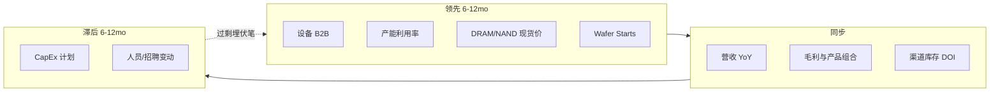

## 是什么

半导体是经典的强周期行业。它的周期不是一个，而是 **三层叠加**：

1. **超级周期（10–15 年）**：由"杀手级应用"驱动，比如 PC（1990s）、智能手机（2010s）、AI（2023–）
2. **大周期（4–5 年）**：由资本开支与需求增长的相位差驱动——经典的"建产能 → 过剩 → 减产 → 短缺"循环
3. **库存小周期（12–18 个月）**：由下游客户的备货与去库存节奏驱动

理解周期不是为了"抄底逃顶"，而是 **判断当下处于哪一段，从而决定关注哪些环节**：
设备 → 制造 → 设计 → 下游，每一段对周期的敏感度和领先 / 滞后关系不同。

> 一句话：**周期不是预测，是观察**。看够了指标，自然知道现在大概在哪。

## 历史与演进：四次大周期

| 周期底部 | 起因 | 顶部年份 | 顶部叙事 | 备注 |
|---|---|---|---|---|
| **2008** | 金融危机 | 2010 | 智能手机起飞、3G 建设 | 苹果 iPhone / 安卓爆发 |
| **2012** | 欧债 + PC 衰退 | 2014 | 移动互联网 + LTE | Qualcomm / MediaTek 崛起 |
| **2015–2016** | 中国移动放缓 | 2018 | "数字货币 + 数据中心 1.0" | 矿机、CSP capex 第一波 |
| **2019** | 中美贸易战 + 库存出清 | 2021 H2 | 新冠居家 + 缺芯 | 全行业涨价、汽车缺芯 |
| **2023 Q1** | 后疫情消费电子崩溃 | **2025–?**（AI 仍在加速） | **AI 算力（生成式）** | HBM/CoWoS 主导，下游消费仍弱 |

**当前位置**（截至 **2026-05**）：

- AI 链条 = **超级周期早中段**（2 年）+ **大周期景气段**——HBM、CoWoS、先进制程产能完全售罄至 2026 年底
- 传统消费电子（手机、PC）= **温和复苏**，AI PC / 端侧 AI 是新故事但出货量贡献仍小
- 存储 = **再涨周期**——HBM 优先 → 普通 DRAM/NAND 价格 2026 H1 持续上修
- 汽车 = **库存出清后期** → 触底但弹性有限
- **风险点**：AI capex 一旦在 2026 H2 出现"投资回报率不及预期"叙事，整链回调速度会很快

参考：[2026-W19 周报](../../weekly/2026-w19)、Avnet "2026 Memory Supercycle"、Deloitte 2026 半导体展望。

## 关键技术 / 概念详解：周期罗盘的 8 个指标

下面这 8 个指标是行业判断周期最常用的"罗盘"，按 **领先 / 同步 / 滞后** 分类。

### 领先指标（提前 6–12 个月）

| 指标 | 怎么看 | 当前读数（截至 2026-05） |
|---|---|---|
| **① 北美设备出货 Book-to-Bill（B2B）** | SEMI 月度发布，>1.0 = 后续景气；<0.95 = 预警 | 受 AI 投资拉动持续 >1.0；消费/成熟节点偏弱 |
| **② 12 寸晶圆产能利用率（UTR）** | 行业整体 >85% = 紧张；<70% = 衰退 | 先进节点 ≈ 满产；成熟 65–75% 区间 |
| **③ DRAM / NAND 现货价（DRAMeXchange）** | 周频，比合约价更敏感 | 2026 Q1 服务器 DRAM 现货 QoQ +50–90%（TrendForce） |
| **④ 12 寸 wafer starts（WSTS、SEMI Manufacturing Monitor）** | 季频；增速由负转正是周期拐点 | 2025 全球 ~9 M 片/月，logic +8% / DRAM +12% YoY |

### 同步指标（与周期同步）

| 指标 | 怎么看 | 当前读数 |
|---|---|---|
| **⑤ 头部公司营收 YoY** | Nvidia / TSMC / SK Hynix / Micron / ASML | 2026 Q1：Nvidia 数据中心 +60%+，AMD 数据中心 +57%，Micron Q2 FY26 +195% |
| **⑥ 毛利率与产品组合** | GM% 高位 + HBM/AI 占比上升 = 周期景气 | Micron Q2 FY26 GM 74.9%（HBM 主导），SK Hynix OPM 49% |
| **⑦ 渠道库存 / 库存周转天数 (DOI)** | 设计公司库存 < 90 天 = 健康；>120 天 = 警戒 | AI / 数据中心：低位；消费 IC：温和正常化 |

### 滞后指标（落后 6–12 个月）

| 指标 | 怎么看 | 当前读数 |
|---|---|---|
| **⑧ CapEx 计划 + 人员变动** | TSMC/三大存储/Intel/SMIC capex 指引；招聘/裁员动态 | 2025 五大代工/存储合计 capex $123B（+24% YoY），2026 指引继续上修 |

> **关键洞察**：CapEx 是滞后指标——当所有人都在追加 capex 时，往往离顶部不远；
> 反之大规模砍单 / 裁员时，往往离底部不远。这就是为什么 **2018 末砍单潮 + 2019 Q2 设备 B2B 跌破 0.7** 是 2020 牛市的前奏。

## 谁在做 / 主要参考来源

| 数据源 | 频次 | 关键指标 |
|---|---|---|
| **SEMI** semi.org | 月 / 季 | Manufacturing Monitor、设备 Billings、Wafer Starts |
| **WSTS**（World Semiconductor Trade Statistics） | 月 | 全球销售额（按地区/产品） |
| **TrendForce** trendforce.com | 周 / 月 | DRAM/NAND/HBM 价格、产能 |
| **DRAMeXchange** | 日 / 周 | 内存现货价 |
| **Gartner / IDC** | 季 | 终端出货（手机、PC、服务器） |
| **公司财报** | 季 | 营收 / 毛利 / 库存 / 指引 |
| **国家统计** | 月 | 中国半导体进出口（海关总署）、韩国 ICT 出口（关税厅） |

## 当前状态与瓶颈：为什么这一轮"看起来不像周期"

2024–2026 这一轮 AI 周期有几个 **反传统特征**：

1. **结构高度分化**：AI / HBM / 先进封装 = 严重短缺；传统消费 IC = 温和正常化；这与历史"全行业一起好/一起差"不同
2. **库存弹性变小**：先进节点 + HBM lead time 长达 12–18 个月，下游 hyperscaler 把"长协 + 产能预订"当作常态
3. **政策成为额外变量**：MATCH Act、AI OVERWATCH Act 等出口管制（参考 [2026-W19 周报](../../weekly/2026-w19)）
   会人为切断部分需求或供给，传统供需模型容易失真
4. **CapEx 集中度极高**：2025 全球前五（TSMC/Samsung/Intel/SK Hynix/Micron）合计 $123B，
   占行业 60%+，他们的指引基本决定下一轮供给
5. **设备 B2B 与 wafer starts 背离**：成熟节点 utilization 下行，但先进节点设备订单创新高——**单一总量指标已不足以判断**

## 投资 / 行业视角：用周期判断关注什么

**周期的"传导链"通常是**：

> 设备（领先 12–18 个月）→ 上游材料（领先 6–12）→ 制造/Foundry（同步）→ Fabless 设计（同步）→ 下游终端（滞后 3–6）

**对应到当前位置（2026-05）**：

- **景气阶段（涨价 / 满产）适合关注**：上游设备（ASML/AMAT/Lam/KLA/TEL）、HBM 三家、先进封装 OSAT、设计端的 AI 链 fabless
- **见顶预警（滞后指标转负）出现时关注**：去库存环节、估值低的成熟节点代工
- **底部信号（B2B < 0.85 + DOI > 120 + CapEx 大砍）出现时关注**：弹性最大的存储与设备

> 但请注意：**没有任何指标能精确预测拐点**。指标的价值在于让你在过热时少加杠杆、在冷却时少恐慌——
> 而不是给出"今天买入 / 明天卖出"的信号。

**周期股估值的反直觉**：

- **高 PE 时往往是底部**——因为 EPS 已被周期打到地板（分母小）
- **低 PE 时往往是顶部**——因为周期顶部 EPS 极高（分母大），PE 看起来"便宜"

详见 [半导体公司怎么估值](./valuation)。

## 推荐阅读

- [半导体公司怎么估值](./valuation)——周期与估值的对应关系
- [HBM 高带宽存储](./hbm)——本轮周期的核心受益资产之一
- [CoWoS 与先进封装](./cowos)——AI 周期的真正瓶颈
- [产业链全景图](../../intro/03-supply-chain-overview)——周期传导链的结构
- [2026-W19 周报](../../weekly/2026-w19)——当前周期的最新数据
- 外部参考：SEMI Manufacturing Monitor、WSTS、TrendForce、Deloitte "2026 Semiconductor Outlook"、Avnet "2026 Memory Supercycle"
