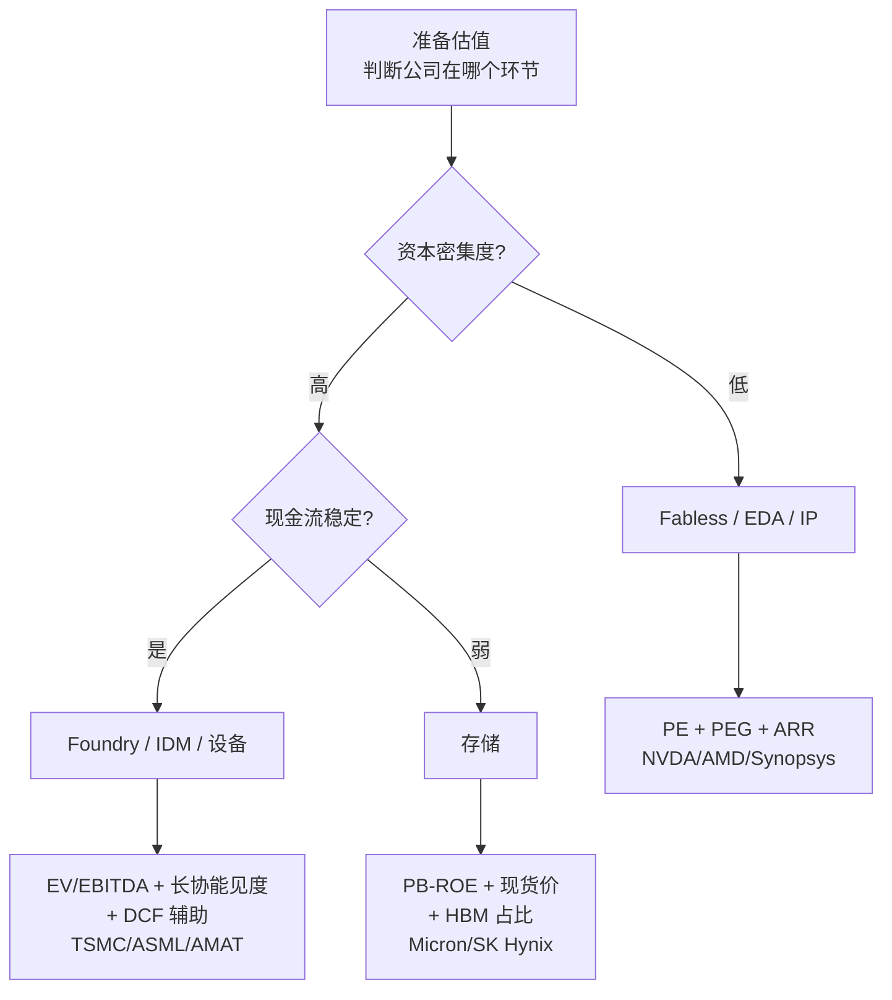

## 是什么

半导体是 **资本密集 + 强周期 + 技术驱动** 的行业，这意味着 **单一估值方法在这里都会失灵**。
- 用 PE 估周期股，会在顶部"看着便宜"、在底部"看着贵"
- 用 DCF 估高资本开支公司，终值假设一动估值翻倍
- 用 PB 估纯设计公司，几乎没有意义（没有重资产）

所以 **估值方法必须匹配产业链环节**。这篇是一张"环节—方法—锚"的对照表。

## 历史与演进：估值方法在半导体的迁移

| 时间 | 主流估值方法 | 背景 |
|---|---|---|
| 1990s | PE / EV-Sales | PC 周期，公司多为 IDM 综合体 |
| 2000–2010 | PE + EV-EBITDA | Fabless / Foundry 分工成型 |
| 2010–2020 | PEG + ARR（EDA / IP） | 成长股估值法兴起 |
| 2020–2023 | EV-Sales + DCF（高 capex） | 缺芯 + capex 暴涨，DCF 终值占比抬升 |
| **2024–2026** | **多锚组合 + 长协能见度** | AI + 周期再定义；hyperscaler 长协订单成为新"锚" |

> **新趋势**：AI 时代的半导体公司估值越来越像"消费成长 + 公用事业"——
> 既有高增速（数据中心 +60–200% YoY），又有长协订单可见度（CoWoS/HBM 已售罄至 2026 年底）。

## 关键技术 / 概念详解：六类估值方法

| 方法 | 公式（简化） | 适合 | 不适合 |
|---|---|---|---|
| **PE（市盈率）** | 股价 / EPS | 稳健成长（Fabless、EDA） | 强周期股（顶底反转） |
| **PEG** | PE / 利润增速 | 高速成长股 | 周期下行段 |
| **EV/EBITDA** | 企业价值 / EBITDA | 高 capex / 高折旧公司（设备、Foundry、IDM） | 现金流极不稳的早期公司 |
| **EV/Sales** | 企业价值 / 营收 | 亏损或微利的成长期 | 商业模式已稳定的成熟公司 |
| **PB / PB-ROE** | 市净率，结合 ROE 看分位 | 强周期资产（存储、Foundry） | 轻资产公司 |
| **DCF（折现现金流）** | 未来 FCF 折现 | 商业模式稳、capex 周期清晰的公司 | 周期波动极大的公司 |

## 谁在做 / 主要环节的估值锚

下表给出 **截至 2026-05-09** 的真实估值数字（数据源：`data/snapshots/2026-05-09.json`，
yfinance 拉取，仅作演示用，请读者自行核对最新报表数据；TTM PE = 过去 12 个月市盈率，N/A = 报表口径下亏损或不可计）：

| 公司 | 环节 | 估值锚 | 收盘价 | TTM PE | Forward PE | 备注 |
|---|---|---|---|---:|---:|---|
| **Nvidia (NVDA)** | Fabless（AI GPU） | PE + PEG（数据中心增速） | $215.20 | 43.8 | 19.1 | 数据中心 FY26 +68%；Forward PE 已反映指引上修 |
| **AMD (AMD)** | Fabless（CPU + AI） | PE + 数据中心营收增速 | $455.19 | **151.7** | 35.3 | TTM 高 PE 因 EPS 仍在恢复；Forward PE 更具参考意义 |
| **Broadcom (AVGO)** | Fabless（ASIC + 网络） | PE + 自由现金流 + 长协 | $430.00 | 84.0 | 23.7 | 含 VMware 业务，需拆分看 |
| **Marvell (MRVL)** | Fabless（光通信、ASIC） | PE + 数据中心收入占比 | $170.13 | 55.6 | 31.3 | AI ASIC 与定制硅故事支撑 |
| **TSMC (TSM)** | Foundry | PE + 产能利用率 + EV/EBITDA | $411.68 | 35.2 | 21.3 | AI capex 的最终受益方 |
| **Intel (INTC)** | IDM + Foundry | EV/EBITDA + 转型故事 | $124.92 | N/A | 81.6 | TTM 亏损，PE 不可用 |
| **Samsung (005930.KS)** | IDM 综合 | PB-ROE + 业务分部 SOTP | ₩268,500 | N/A | 5.3 | 综合体，需分 DS / DX 估 |
| **SK Hynix (000660.KS)** | 存储 | PB-ROE + DRAM 价格 | ₩1,686,000 | N/A | 4.6 | HBM 龙头，Forward PE 反映强景气 |
| **Micron (MU)** | 存储 | PB-ROE + DRAM 价格 + HBM 占比 | $746.81 | 35.2 | 7.3 | Forward PE 反映 HBM4 + 涨价周期 |
| **ASML (ASML)** | 设备（EUV/High-NA） | EV/EBITDA + bookings 能见度 | $1,592.02 | 52.4 | 33.2 | 订单 backlog 是核心锚 |
| **Applied Materials (AMAT)** | 设备 | EV/EBITDA + 产能利用率 | $435.44 | 44.7 | 30.9 | 多产品线，受 logic + memory 双周期影响 |
| **Lam Research (LRCX)** | 设备（刻蚀） | EV/EBITDA + DRAM/NAND 周期 | $294.05 | 55.6 | 37.2 | 内存 capex 敏感度高 |
| **KLA (KLAC)** | 设备（量测） | EV/EBITDA + 先进节点占比 | $1,869.19 | 52.9 | 37.7 | 量测刚需，毛利率最高 |
| **Tokyo Electron (8035.T)** | 设备 | EV/EBITDA + 涂胶/显影份额 | ¥52,450 | 42.0 | 41.0 | 与 EUV/coater 强绑定 |
| **SMIC (0981.HK)** | Foundry（中国） | PB-ROE + 国产替代叙事 | HK$73.35 | **104.8** | 56.3 | TTM PE 高因 EPS 受 capex 折旧压制 |
| **北方华创 (002371.SZ)** | 设备（中国） | PE + 国内订单能见度 | ¥540.79 | 70.4 | 34.6 | 国产替代核心标的之一 |
| **中微公司 (688012.SS)** | 设备（中国，刻蚀） | PE + 5nm 产线渗透 | ¥370.00 | 85.5 | 51.6 | 海外客户拓展是关键变量 |
| **华大九天 (301269.SZ)** | EDA（中国） | EV/Sales + ARR 增速 | ¥92.20 | N/A | 576.3 | TTM 微利，Forward PE 失真 |

> **数据源说明**：以上数据为 2026-05-09 yfinance 抓取（美股 5/8 收盘 / A 股、港股、日韩股 5/9 收盘）。
> 本文不构成投资建议。所有数字会随报表与股价变化，请以最新数据复核。

### 不同环节的估值"实战要点"

#### 1. 设备（ASML / AMAT / LAM / KLA / TEL）

- 主锚：**EV/EBITDA 历史区间** + **bookings backlog（订单能见度）**
- 关键：B2B 比率、CapEx 周期位置、EUV/High-NA 客户接单节奏
- **ASML 的特殊性**：垄断 EUV → 估值溢价 50%+ vs 其他设备厂；EXE:5000 High-NA 出货是新催化

#### 2. Foundry / IDM（TSMC / Intel / SMIC）

- 主锚：**PE + EV/EBITDA**，辅以 **产能利用率（UTR）、自由现金流**
- TSMC：GM 50%+、ROE 20%+ 已成基准，PE 区间 20–35×，与 capex 相位强相关
- Intel：仍处转型期，不能用历史 PE 框架；用 **EV/Revenue + 18A 节点客户数** 倒推
- SMIC：估值锚是"国产替代叙事溢价" + 折旧压力（capex 高、ROE 低），TTM PE 长期 50–100×

#### 3. Fabless（NVDA / AMD / Broadcom / Marvell / Qualcomm / MediaTek）

- 主锚：**PE + PEG**，辅以数据中心营收占比与增速
- **NVDA 案例**：2024–2026 PE 长期 40–60×（TTM），但 Forward PE 仅 ~20×，反映"未来 12 个月 EPS 翻倍"的预期
- **AMD 案例**：TTM PE 150× 看似离谱，但 Forward PE 35× 反映 EPS 正在快速修复
- 何时警惕：**Forward PE 与 TTM PE 的"剪刀差"开始收敛**（即增速放缓被市场确认）

#### 4. 存储（Micron / SK Hynix / Samsung 内存部门）

- 主锚：**PB-ROE 历史分位** + **DRAM 价格 + HBM 占比**
- 经典周期股：**高 PE（甚至 N/A）通常是底部，低 PE 通常是顶部**——盈利在分母上做剧烈摆动
- 现代变化：HBM 把"通用存储"转成"长协订单 + 高毛利"，更接近 Foundry 的估值逻辑

#### 5. EDA / IP（Synopsys / Cadence / Arm / 华大九天）

- 主锚：**PE + ARR（年化经常性收入）增速**
- ARR 转化率高 → 接近"软件 SaaS"估值，PE 区间长期 40–60×
- 中国 EDA：故事溢价 + 营收基数小 → PE 不具可比性，看 ARR / 客户数 / 节点覆盖

#### 6. 封测 OSAT（ASE / Amkor / 长电）

- 主锚：**EV/EBITDA + 先进封装占比**
- CoWoS / FOCoS / SiP 等先进封装订单是估值溢价来源；传统打线封装周期波动大

## 当前状态与瓶颈：估值的"反直觉"问题

### 为什么 NVDA 150× PE 仍能涨

不是 PE 本身在涨，而是 **EPS 涨得比股价快**。Forward PE 一直被新指引压低，
长协订单 + 数据中心 capex + Blackwell/Rubin 路线图共同支撑"未来 4–8 个季度 EPS 仍快速增长"。
**何时该警惕**：

- Forward PE 与 TTM PE 的剪刀差开始收敛
- Hyperscaler capex 指引下修
- HBM/CoWoS 长协出现"重新议价"或松动

### 周期股估值的反直觉

历史上看：

- 2018 Q4 Micron PE 跌到 4×（顶部 EPS 极高）→ 2019 暴跌
- 2020 Q1 Micron PE 升到 N/A（亏损）→ 2021 大涨
- 同样模式在 2022 Q4–2023 Q1 重演

> 这就是为什么 PB-ROE 比 PE 更适合存储股：**ROE 在周期顶部 30%+，底部 -10%；PB 在 0.7–2.5× 区间摆动**。
> 在 PB < 1 + ROE 触底 + DRAM 现货止跌时通常对应底部。

### DCF 在半导体的限制

- 资本开支波动极大（TSMC 2024 ~$30B、2025 ~$40B、2026 指引 $42B+），FCF 难线性外推
- 终值（Terminal Value）通常占估值 70%+，对永续增长率假设极敏感
- **更好的用法**：DCF 用作"敏感性测试"（多组假设的区间），而不是"目标价"

## 投资 / 行业视角

**几个普适原则**（不构成投资建议）：

1. **方法要匹配环节**：用 PE 看设备 / 用 PB 看设计 / 用 DCF 看周期股，都会出错
2. **Forward 视角优于 TTM**：半导体业绩季度间剧烈波动，TTM 滞后；Forward 反映市场对下一周期的隐含假设
3. **多锚交叉**：PE + EV/EBITDA + PB-ROE + 长协 backlog，看是否一致；分歧大时往往是周期拐点
4. **结合周期位置**：参考 [如何识别半导体周期位置](./cycle)，估值方法只是横截面，周期罗盘是时间轴
5. **警惕"叙事溢价"**：AI / 国产替代 / 第三代半导体都可能给出 50–100% 的估值溢价；故事兑现速度决定溢价是否可持续

**主要风险**：

- 单一指标（如 TTM PE）误判周期位置 → 在顶部加仓、在底部割肉
- DCF 永续增长率假设失真 → 估值中枢飘移
- 长协 backlog 兑现节奏不及预期 → 设备/封装/存储三链同步重估

## 推荐阅读

- [如何识别半导体周期位置](./cycle)——估值的时间轴
- [HBM 高带宽存储](./hbm)——存储周期重估的核心变量
- [CoWoS 与先进封装](./cowos)——长协能见度的来源
- [TSMC 公司档案](../../companies/tsmc)
- [2026-W19 周报](../../weekly/2026-w19)——估值快照与最新数据
- 外部参考：Damodaran 估值教材（行业框架）、各公司投资者关系页 / 季报、SEMI / WSTS 行业数据
